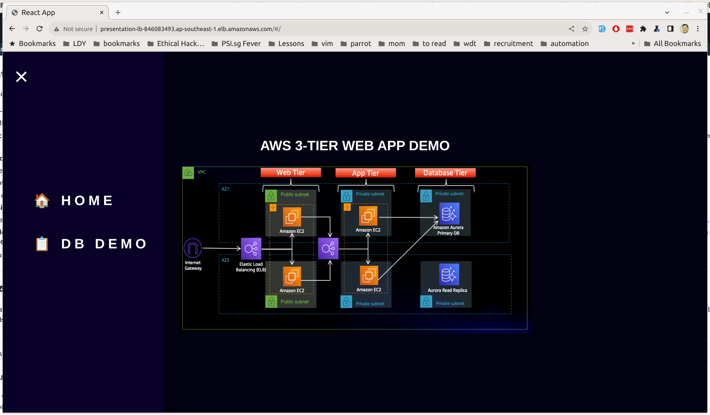

# Background

I have limited experience on actual Terraform provisioning. I am trying my best to reason and come out with a solution that fit the requirements.

**Note:** The deployment application I have forked from AWS workshop https://github.com/aws-samples/aws-three-tier-web-architecture-workshop. I modified some bit to suit this assignment.

# High-level Requirements

- A private network which would best suit Symbiosis’s 3-tier architecture needs. In order to meet their internal SLA’s they require a highly scalable solution as well.
- Symbiosis being a B2C company, needs their applications to be accessible over the internet.
- Symbiosis aims to reduce the administrative burden of managing their database and prefer a managed and highly scalable database.
- Symbiosis encounters medium to high traffic levels daily during business hours. Given the fluctuating nature of this traffic, they are in need of a cost-effective solution that can dynamically scale to meet varying workload demands automatically.
- Symbiosis is interested in your recommendations for various metrics that can be monitored to enhance customer satisfaction.

# Tasks

- You are expected to use AWS for this assignment, to keep cost minimum try limiting to free tier eligible resources.
- Use Terraform to build the challenge using IaC
- Push the completed assignment to any public repo (Github or Gitlab)
- You can choose any application to host for assignment#1. A good example of a web application that does CRUD operations can also be found here: https://github.com/chapagain/nodejs-mysql-crud

#### Solution:

All the files are under `./tf` folder. Since this is a phase by phase setup. Suggest to copy files step by step.

Let's create a user so we could start provisioning. Make sure we have an admin profile called `cc4`.

- Copy user setup under `./tf/01-user.tf` to a new folder i.e. `./cc4`

**Note**: For security, we could have stricter policy and enforce MFA for the group

```bash
# Run under ./cc4/ folder
terraform init

terraform plan

terraform apply
```

---

Then we should setup the remote state instead local versioning the state.

- Copy remote state setup under `./tf/02-remote-state.tf` to `./cc4`

```bash
# Run under ./cc4/ folder
terraform plan

terraform apply
```

- Copy backend setup under `./tf/03-terraform.tf` to `./cc4`

```bash
# Run under ./cc4/ folder
terraform init
```

Then answer `Yes` for copying the state to the remote and remove the local state file.

```bash
rm terraform.tfstate
```

---

Create the three tier architecture starting by create a simple vpc with 6 subnets across two AZ (2 publics and 4 privates).

- Copy vpc & subnets setup under `./tf/04-vpc.tf` to `./cc4`
- Copy vpc variables under `./tf/04-vpc.variables.tf` to `./cc4`

```bash
# Run under ./cc4/ folder
terraform init

terraform plan

terraform apply
```

---

Next to setup the basic networking of the tiers. We will create:

1. Security groups
2. Internet gateway (for outgoing and incoming traffic to the internet from public subnet)
3. Route tables

- Copy networking setup under `./tf/05-network-tier-1.tf` to `./cc4`
- Copy networking setup under `./tf/05-network-tier-2.tf` to `./cc4`
- Copy networking setup under `./tf/05-network-tier-3.tf` to `./cc4`

```bash
# Run under ./cc4/ folder
terraform plan

terraform apply
```

---

Let's get into Database deployment now.

- Copy database setup under `./tf/06-database.tf` to `./cc4`

```bash
# Run under ./cc4/ folder
terraform plan

terraform apply
```

After the RDS is up, we will need a workable AMI so we can deploy multiple instances on top the Application Tier.

I have created a public AMI for this assignment in `ap-southeast-1` (Singapore) region. i.e. `ami-0b1b0624d08c7c5fa`

**Note:** I have set the DB config directly in the AMI, aware this should be in 3rd-party key management service.

---

In order to achieve highly scalable and fault tolerance system. We could make use of AWS auto-scaling group. Resources are:

1. Security group in between tiers
2. Target group for instances
3. Load balancer
4. Launch template (make use of application AMI)
5. Auto-scaling group make use of the launch template

- Copy auto scaling setup under `./tf/07-auto-scaling-tier-2.tf` to `./cc4`
- Copy auto scaling variables under `./tf/07-auto-scaling-tier-2.variables.tf` to `./cc4`
- Update the file security group to allow load balancer to access under `./tf/05-network-tier-2.tf`
  - uncomment line 19
  - comment out line 20

```bash
# Run under ./cc4/ folder
terraform plan

terraform apply
```

---

We have arrived at the outer tier, i.e. presentation tier. Let's create similar setup as tier 2.

I have created a web tier AMI, i.e. `ami-0f10f8182f58a5e91` in `ap-southeast-1` (Singapore).

- Copy auto scaling setup under `./tf/08-auto-scaling-tier-1.tf` to `./cc4`
- Copy auto scaling variables under `./tf/08-auto-scaling-tier-1.variables.tf` to `./cc4`
- Update the file security group to allow load balancer to access under `./tf/05-network-tier-1.tf`
  - uncomment line 19
  - comment out line 20

```bash
# Run under ./cc4/ folder
terraform plan

terraform apply
```

If all run smoothly, we could just try visit the dns from the internet facing load balancer by outputting:

```bash
# Run under ./cc4/ folder
terraform output
```

**Note:** The workshop application is intended to use Aurora DB, which I am using RDS/Mysql so the home image will be different.

I have deployed it at: http://presentation-lb-846083493.ap-southeast-1.elb.amazonaws.com/#/


