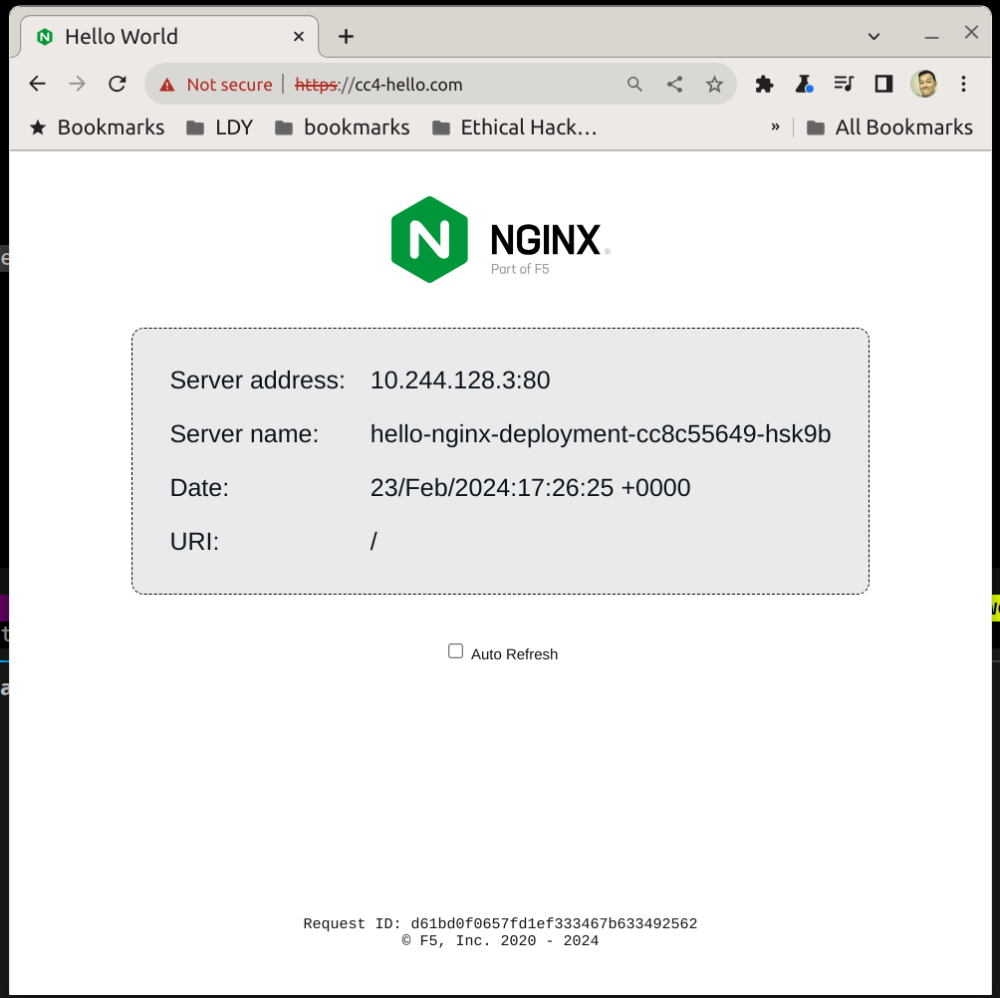

# Background

I don't have any experience on Minikube.
I choose Kubeadm for the tasks because recently studying kubernetes via Udemy and it is closer to my finger. Take it as challenges for myself!

[kubeadm setup here](kubeadm/setup.md)

# Tasks

1. Deploy the "Hello World" application:

- Create a Kubernetes deployment for the nginxdemos/hello image.
- Configure the deployment to expose the application on port 80.

#### Solution:

Run the below to create a deployment with 2 replicas

```bash
kubectl apply -f ./yaml/deployment.yaml

# To get the pod ips
kubectl get pod -o wide

# Test out the pod
curl <ip>
```

2. Service Discovery and Ingress:

- Create a Kubernetes service to expose the application to external access.
- Configure a simple Ingress resource to expose the application through Minikube's Ingress controller.

#### Solution:

Run the below to create a hello cluster ip service

```bash
kubectl apply -f ./yaml/service.yaml

# To get cluster ip
kubectl get service hello-service

# Get to the cluster ip (in master node), test multiple times for diff ips returning
curl <cluster-ip>
```

[ingress controller setup here](ingress/setup.md)

## After above ingress setup, visit to https://cc4-hello.com



3. Persistence:

- Modify the deployment to mount a Persistent Volume Claim (PVC) to the container.
- This PVC should be backed by a Persistent Volume (PV) that persists data across container restarts.
- Choose an appropriate type of storage for the PV.
